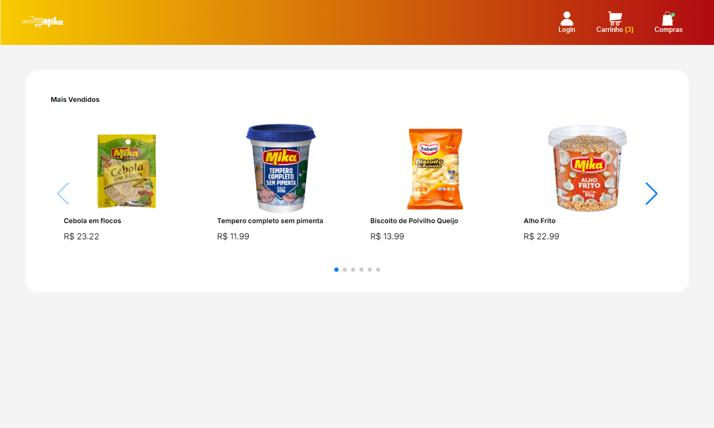
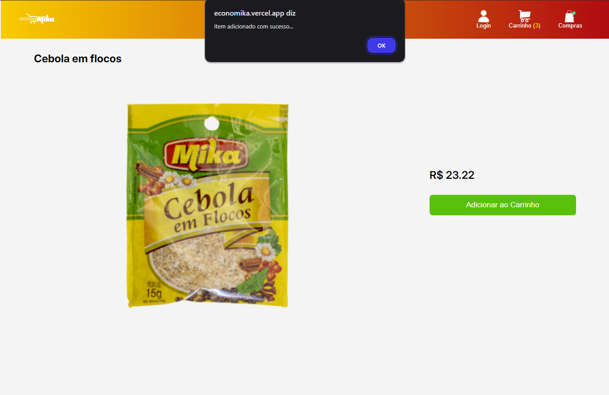
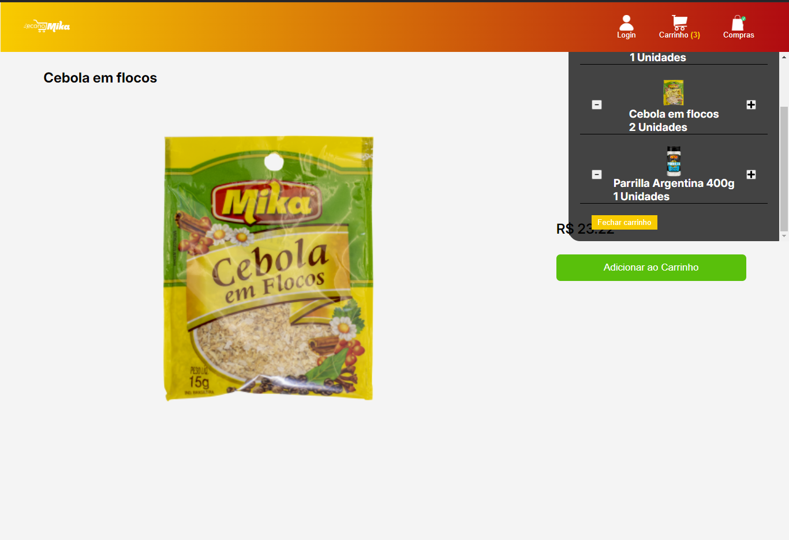
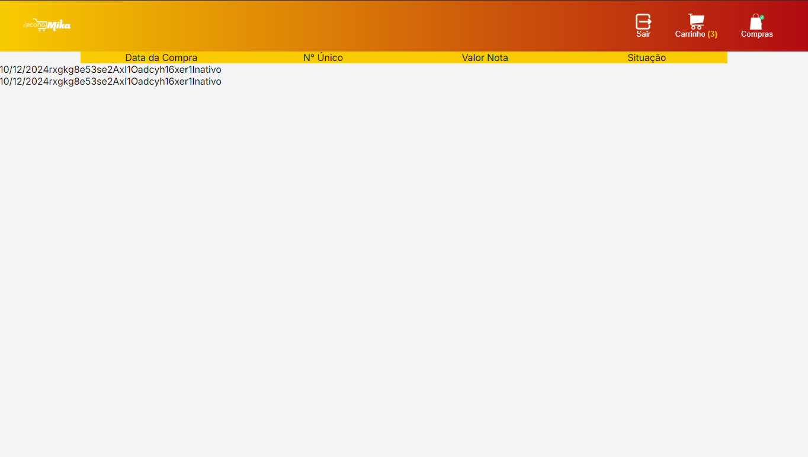

# Mini Lojinha Virtual

Descrição:
Projeto de uma aplicação web para ecommerce, desenvolvida com React e Firebase. O sistema inclui:

* Gerenciamento de produtos e carrinho de compras dinâmico. 
* Autenticação de usuários com Firebase Authentication.
* Persistência de dados no Firestore.
* Interface responsiva e otimizada para dispositivos móveis.

### O objetivo do projeto é oferecer uma experiência de compra online funcional e eficiente, aplicando boas práticas de desenvolvimento e organização de código.

## login de teste  
### teste@gmail.com
### 123456

# Páginas

### Home

### Detalhes

### Carrinho

### Compras

### Proximas atualizações
* Estilizar melhor a pagina de compras
* Usuário ADM para administrar as compras
* Adicionar método de pagamento

